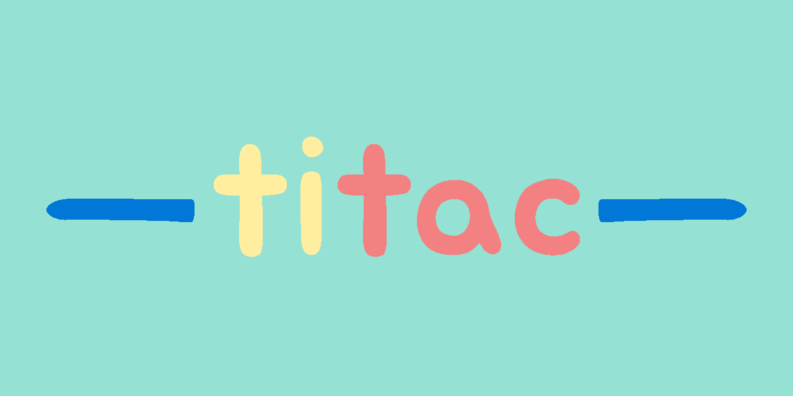

# [Play here](https://codyadam.github.io/react-redux-game/)

# Concept

This is 'Titac' a Tic-Tac-Toe game with a new mechanic

It's Tic-Tac-Toe but you can place up to 3 mark per cell

# The Rules

- 2 players
- turn by turn each player place a mark on a 3x3 grid
- each grid tile has a maximum of 3 marks
- you gain 1 point for each row, column or diagonal
- 3 points to win

# Technologie

- [Typescript](https://www.typescriptlang.org/)
- [React](https://reactjs.org/)
- [Redux Toolkit](https://redux-toolkit.js.org/)
- [create-react-app](https://create-react-app.dev/) template : [redux-typescript](https://github.com/reduxjs/cra-template-redux-typescript)
